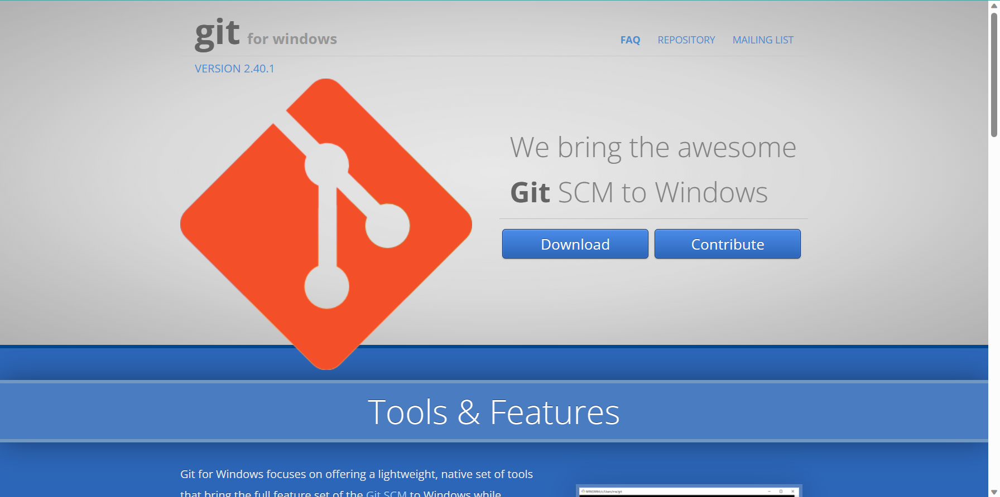
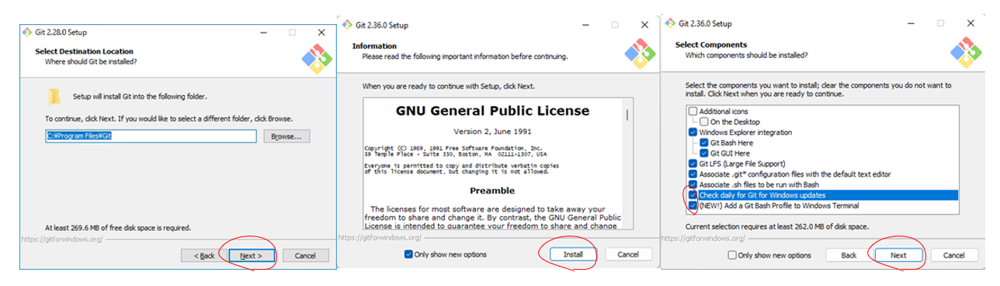
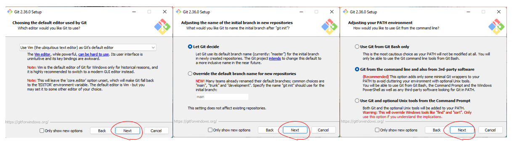
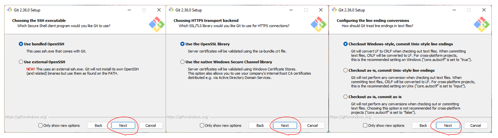
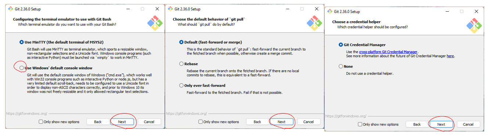
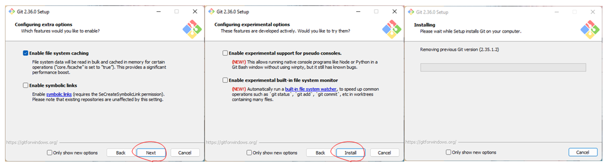
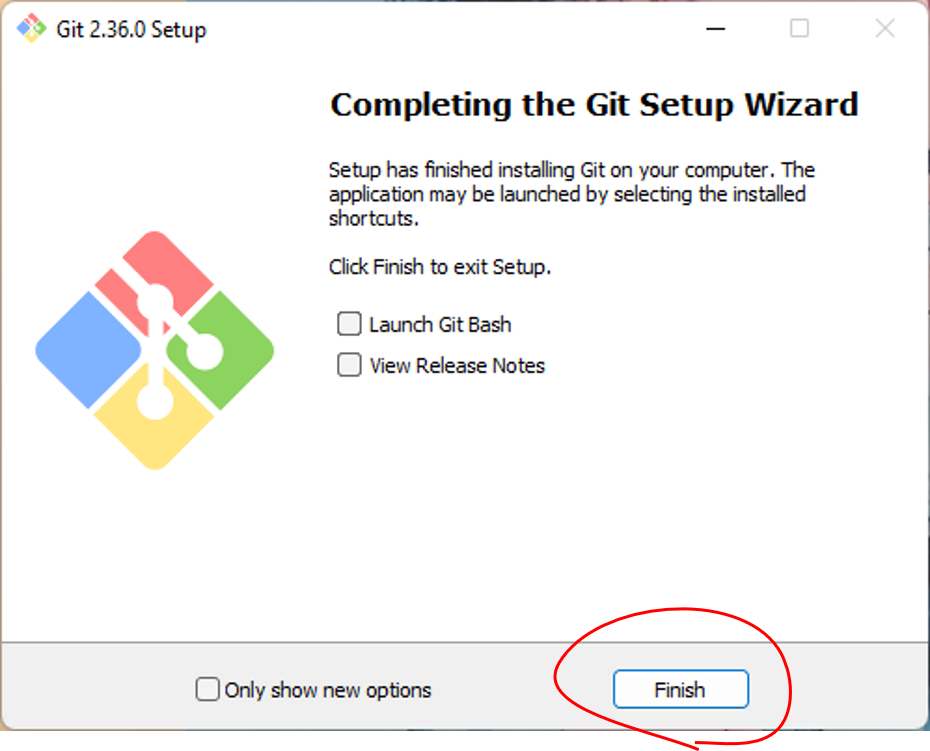
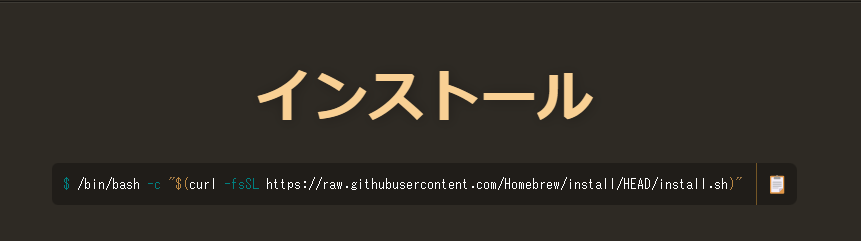
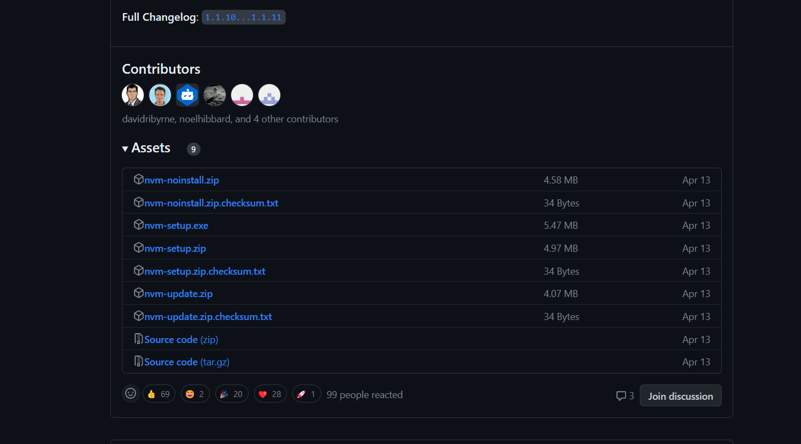

# Webサービス勉強会2023

## 環境構築

### 🛠️ 必要なツール

- git
- vscode
- nodejs

### gitのインストール

####  Windows の人

※ 5/13のみんげーに参加していただいた方は終わっているので読み飛ばしてください

1. <https://gitforwindows.org> にアクセス

2. Downloadボタンをクリック



3. ダウンロードしたインストーラーを開いてインストール













4. PowerShellを開いて

```powershell
git --version
```

と入力

```powershell
git version 2.40.1.windows.1
```

みたいに表示されたら成功！

5. ユーザー名とメールアドレスを登録

```powershell
git config --global user.name "ユーザー名"
git config --global user.email "メールアドレス"
```

#### macの人

1. Launchpadから  をクリックして、検索ボックスから「ターミナル」を検索

2.  を起動

3. 

```zsh
git --version
```

を実行

```zsh
git version 2.30.2
```

みたいな表示が出てきたら最初から入っています。4.を飛ばして5. へ

4. 出てこなかった人はgitが入っていません

<https://brew.sh/index_ja> へアクセスして



のようにインストールコマンドをターミナルで実行

終わったら

```zsh
brew install git
```

を実行

再度

```zsh
git --version
```

を試してみてください。

5. ユーザー名とメールアドレスを登録

```powershell
git config --global user.name "ユーザー名"
git config --global user.email "メールアドレス"
```

### vscode のインストール

※プログラミング入門に参加している方は既にvscodeが入っているので、必要ありません。

1. <https://code.visualstudio.com/>を開く


2. Windowsの人はDownload for Windowsから

Macの人は右の▼からmac版を選択

インストーラーを起動

設定はデフォルトで次へを連打

### nodejs

####  Windows の人

2つの方法があります

1. WSLにインストールする
2. Windows版をインストールする

---
WSL

1. Ubuntuを起動します
2. nvmのインストール

<https://github.com/nvm-sh/nvm#install--update-script>

```bash
curl -o- https://raw.githubusercontent.com/nvm-sh/nvm/v0.39.3/install.sh | bash
```

完了したらターミナルを閉じてもう一度開く

3. nvm経由でnodejsをインストール

```bash
nvm install 18.16.0
```

4. インストールされたか確認

```bash
nvm list
```

5. 使うバージョンを選択

```bash
nvm use 18.16.0
```

6. 完了！

---
Windows版

1. <https://github.com/coreybutler/nvm-windows/releases>からnvm-setup.exeをダウンロードして開く



2. ターミナルを開く

3. nvm経由でnodejsをインストール

```powershell
nvm install 18.16.0
```

4. インストールされたか確認

```powershell
nvm list
```

5. 使うバージョンを選択

```powershell
nvm use 18.16.0
```

6. 完了！


#### macOS

https://dev-yakuza.posstree.com/environment/nvm/


#### テスト

完了したら、PowerShell / ターミナルを開いて

```powershell
git clone https://github.com/kmc-jp/2023-web.git
```

```powershell
cd ./2023-web/section01
```

```powershell
npm install
npm run dev
```

しばらく待って `event compiled client and server successfully` と出たら、ブラウザから、 <http://localhost:3000> にアクセス！

下のような画面が表示されればOKです！


