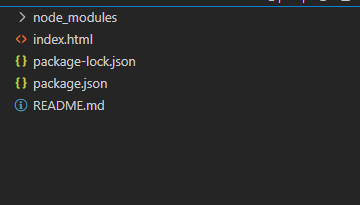

# Webサービス勉強会2023 第3回

(2023/05/28)
HTMLとCSSについて、一緒に手を動かしながら簡単におさらいしましょう！

## 準備

環境構築が終わっていない人は[第1回資料](../section01/README.md)を基に構築してください。

1. Section03の追加を手元に取得します

WSL or Powershellを開いて（前回どちらでセットアップしたか思い出してください）

```bash
cd ~/2023-web
git pull
```

> No Such file or directory
とか言われたら以下を実行してください

2. 2023-webリポジトリをcloneします (optional)

```bash
cd ~
git clone git@github.com:kmc-jp/2023-web.git 
```

3. section03に移動します

```bash
cd ~/section03
```

4. サーバーを起動します

```bash
npm install
npm run dev
```

5. ブラウザからアクセスします

自動的に開くと思います

開かなければ <http://localhost:8080> にアクセス

Hello World!と表示されていればOKです！

いったんCtrl+Cで止めます

## HTMLの編集

1.  VSCodeの起動

~/2023-web/section03をターミナルで開いている状態で

```bash
code .
```
とするとVSCodeで開きます

2. index.htmlを探す

~/2023-web/section03/index.htmlです



3. 中身を見る

```html
<!DOCTYPE html>
<html lang="ja-JP">
  <head>
    <meta charset="utf-8">
    <link rel="stylesheet" href="style.css">
    <script src="script.js" defer></script>
    <title>section 03 | 2023-web</title>
  </head>
  <body>
    <p>Hello World!</p>
  </body>
</html>
```

4. もう一度Webサーバーを起動

ターミナルに戻って

```bash
npm run dev
```

<http://localhost:3000> にアクセス

今日の講習会中はつけっぱにします

## CSSの基礎

今回はCSSについて基礎的事項をやります。

CSSはページのデザインについて指定するための言語です。
CSSでは、特定の要素に適用するスタイルをルールとして書き並べていきます。

とにかくまずは簡単に試してみます

`index.html` と同じ階層に `style.css` があるはずです。まだ中身は空です。

以下の内容を書いてみましょう

```css
p {
  color: red;
  font-size: 5em;
}
```

さて、ブラウザを開いてみましょう。見た目はどうなっていますか？　「Hello World!」の文字列がでかでかと真っ赤に表示されているでしょうか？

## CSSの基本構造

`p` の部分をセレクターといいます。
これは適用対象を指定するものです。今回は段落要素`p`の全てを指定しています。
複数`p`要素があればすべてに適用されます。試してみましょう

中かっこ`{ }`の中には、プロパティと値の組み合わせを書きます。
`color`や`font-size`の方がプロパティ、`red`や`5em`の部分を値です。
`プロパティ: 値;`という形で書きます。
1つのセレクターに対してプロパティとプロパティ値の組は複数記述することができます。


## index.htmlに要素を追加する

今のままだといじれる場所が少ないので、CSSの説明のために様々な要素を追加しておきます。
`index.html`を以下のように編集してください

```html
<!DOCTYPE html>
<html lang="ja-JP">
  <head>
    <meta charset="utf-8" />
    <link rel="stylesheet" href="style.css" />
    <script src="script.js" defer></script>
    <title>section 03 | 2023-web</title>
  </head>
  <body>
    <h1>2023-web 第3回</h1>
    <p>WebService勉強会2023の<span>第3回</span>です。</p>
    <p>
      これは<a href="https://kmc.gr.jp/">KMC</a
      >が開催する春プロジェクトの一つです。
    </p>
    <div class="projects">
      <h2>春プロジェクトの一覧</h2>
      <ul>
        <li>みんなでゲームを作る2023</li>
        <li>お絵かきプロジェクト2023</li>
        <li>自宅サーバー勉強会(Linux勉強会)2023</li>
        <li>Webサービス勉強会2023</li>
        <li>サウンドプログラミング講習会</li>
        <li>Unity勉強会2023</li>
        <li>DTM練習会2023</li>
        <li>簡潔データ構造をつくろう</li>
        <li>分散システム勉強会</li>
        <li>プログラミング入門2023</li>
      </ul>     
    </div>
    
    <div class="buttons">
      <button id="button1" type="button">これはボタンです</button>
      <button id="button2" type="button">これもボタンです</button>
      <button id="button3" type="button">これも実はボタンです</button>
    </div>
  </body>
</html>
```

## 指定方法

### [要素名による指定](https://developer.mozilla.org/ja/docs/Web/CSS/Type_selectors)

要素名を直接記述します。

```css
body {
  background-color: #333333;
  color: white;
}

a {
  color: #cccccc;
  text-decoration: none;
}
```

全ての要素に対してCSSを割り当てる場合は、`*`を記述します。

> [全称セレクター | MDN](https://developer.mozilla.org/ja/docs/Web/CSS/Universal_selectors)

```css
* {
  color: white;
}
```

### [クラスによる指定](https://developer.mozilla.org/ja/docs/Web/CSS/Class_selectors)

クラス名の前に`.`を付けて指定します。

```css
.projects {
  border-radius: 8px;
  box-shadow: 0 0 4px #77777777;
  display: inline-block;
  padding: 8px;
  margin: 10px;
}
```

### [idによる指定](https://developer.mozilla.org/ja/docs/Web/CSS/ID_selectors)

id名の前に`#`を付けて指定します。

```css
#button1 {
  color: white;
  background-color: #36b9ec;
  box-shadow: 3px 3px 5px #77777777;
  border-color: #00000000;
  border-radius: 8px;
  padding: 10px;
  margin: 15px;
}
```

### [属性による指定](https://developer.mozilla.org/ja/docs/Web/CSS/Attribute_selectors)

`[{属性名}={属性値}]`の形式で指定します。属性値が存在しない場合は、`[{属性名}]`の形式で指定します。


```css
a [href="https://kmc.gr.jp/"] {
  color: green;
}
```

## 基本的なプロパティ

### テキスト色

テキストの色を指定するには、[`color`プロパティ](https://developer.mozilla.org/ja/docs/Web/CSS/color)を使用します。

```css
p {
  color: black;
}
```

```css
p {
  color: #eeeeee;
}
```

### 背景色

要素の背景色を指定するには、[`background-color`プロパティ](https://developer.mozilla.org/ja/docs/Web/CSS/background-color)を使用します。

```css
body {
  background-color: gray;
}
```

### 背景画像

### フォント
フォントの指定には、[`font-family`プロパティ](https://developer.mozilla.org/ja/docs/Web/CSS/font-family)を使用します。

```css
p {
  font-family: Gill Sans Extrabold, sans-serif;
}
```

フォントサイズの指定には、[`font-size`プロパティ](https://developer.mozilla.org/ja/docs/Web/CSS/font-size)を使用します。

```css
.projects {
  font-size: 12px;
}
```

```css
.projects {
  font-size: 1.2em;
}
```

```css
.projects {
  font-size: smaller;
}
```

### 太字・斜体

太字の指定には、[`font-weight`プロパティ](https://developer.mozilla.org/ja/docs/Web/CSS/font-weight)を使用します。

```css
h1 {
  font-weight: bold;
}
```

```css
h1 {
  font-weight: lighter;
}
```

斜体の指定には、[`font-style`プロパティ](https://developer.mozilla.org/ja/docs/Web/CSS/font-style)を使用します。

```css
h1 {
  font-style: italic;
}
```

### テキスト修飾

テキスト装飾の指定には、[`text-decoration`プロパティ](https://developer.mozilla.org/ja/docs/Web/CSS/text-decoration)を使用します。

```css
.message-important {
  text-decoration: red wavy underline;
}
```

### 文字間隔

文字間隔の指定には、[`letter-spacing`プロパティ](https://developer.mozilla.org/ja/docs/Web/CSS/letter-spacing)を使用します。

```css
.projects {
  letter-spacing: .2rem;
}
```

```css
.projects {
  letter-spacing: -1px;
}
```

### 行の高さ

行の高さの指定には、[`line-height`プロパティ](https://developer.mozilla.org/ja/docs/Web/CSS/line-height)を使用します。

`line-height`プロパティには、単位のない値を指定するのが好ましいとされています。

```css
.projects {
  line-height: 2;
}
```

### 枠線

枠線の指定には、[`border`プロパティ](https://developer.mozilla.org/ja/docs/Web/CSS/border)を使用します。

```css
.projects {
  border: 1px solid orange;
}
```

```css
.projects {
  border: thick double #32a1ce;
}
```

### 角丸

角丸の指定には、[`border-radius`プロパティ](https://developer.mozilla.org/ja/docs/Web/CSS/border-radius)を使用します。

```css
button {
    border-radius: 32px;
}
```

### 透明度

要素全体の指定には、[`opacity`プロパティ](https://developer.mozilla.org/ja/docs/Web/CSS/opacity)を使用します。

このプロパティは子要素にも継承されます。

背景色のみを透過したり、テキスト色のみを透過したりする場合は、背景色やテキスト色を透明度付きの色で指定してください。

```css
img {
  opacity: 0.5;
}
```

### 幅・高さ

```css
img {
  height: 250px;
  width: 500px;
}
```

### paddingとmargin

余白を指定するプロパティに、`padding`と`margin`があります

`padding`は、枠より内側の余白を、`margin`は枠より外側の余白を指定します
以下のcssを使うと分かりやすいでしょう。

```css
.buttons {
  border: 2px solid orange;
}

#button1 {
    border: 2px solid blue;
    margin: 0;
    padding: 0;
}

#button2 {
    border: 2px solid blue;
    margin: 50px;
    padding: 0px;
}

#button3 {
    border: 2px solid blue;
    margin: 0px;
    padding: 50px;
}
```

CSSについてはこれくらいにしておきます。
基本的な事項さえ理解していれば後は、「やりたいこと+CSS」で検索すれば大抵のことはできるでしょう。
より詳しく学びたい人は [MDNのCSSの章](https://developer.mozilla.org/ja/docs/Learn/CSS) を見てみましょう。

## JavaScript

JavaScriptは、ページに大して動的な変化を与えるときに使われるスクリプト言語です。

まずは、`index.html`と同じディレクトリにある`script.js`を次のように変更します。

```js
document.addEventListener('DOMContentLoaded', () => {
  function createParagraph() {
    const para = document.createElement('p');
    para.textContent = 'ボタンが押されました!';
    document.body.appendChild(para);
  }

  const buttons = document.querySelectorAll('button');

  for (const button of buttons) {
    button.addEventListener('click', createParagraph);
  }
});
```

さて、ブラウザを見てください。特に見た目では何も変わっていませんね。

では、三つあるボタン、どれでもいいので押してみましょう。どうなりましたか？

「ボタンが押されました!」という文字列が下の方に表示されたのではないでしょうか。

このように、JavaScriptを使うと、「ボタンが押されたとき」などの動的なイベントによって、新しく要素を追加/削除したり、編集したりできるのです。

動作を簡単に追ってみます。

まず、`script.js`自体は、`index.html`の、`html.head.script`の部分で読み込まれています。ここで、`defer`属性をつけることで、JavaScriptの読み込みを待たずにHTMLを読み込み、DOMを作ります。HTMLは上から順番に読み込まれていくので、こうしておかないとJavaScriptが読み込まれた後の要素にアクセスできなくなってしまいます。

さて、`script.js`が無事に読み込まれたので中身の処理を見ていきます。
まず、

```js
document.addEventListener('DOMContentLoaded', () => {
  ...
});
```

とありますね。